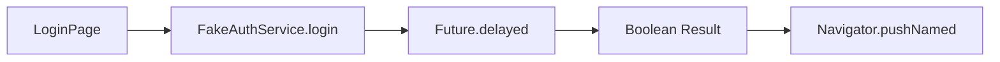

# Data Flow

Understanding how data travels through the Anti-Diabetes AI App.

## High-Level Data Cycle

1. **Trigger**: User interacts with a UI component (e.g., clicking 'Login').
2. **Action**: The UI calls a function from a Service (e.g., `FakeAuthService.login()`).
3. **Execution**: The Service performs an action (fake API call with delay).
4. **Return**: The Service returns a result (e.g., `true` or `false`).
5. **Update**: The UI reacts to the result by updating its local state or navigating to a new screen.

## Unidirectional Flow Principle

Although the app is in its early stages, it follows a unidirectional flow:

- **UI to Service**: UI components never fetch data directly from a database or API; they always go through the `core/services` layer.
- **Service to Model**: Services transform raw data (JSON) into strongly-typed Dart models (planned for future phases).

## Example: Authentication Flow

## Current Limitations

- **No Central Persistence**: Data is currently lost when the app is closed.
- **Static models**: Data models are currently hardcoded or simplified values.
